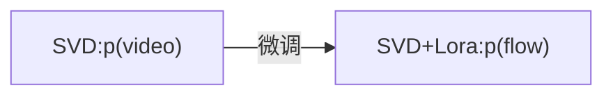

# 代码文档

本目录汇总了3-6月期间在vivo实习过程中的工作的代码，本文档对代码结构与内容进行整理与说明。

## 简介

实习中尝试过的工作包括：

- 基于SVD模型，试图通过稀疏点轨迹控制生成视频的动态（失败）
- 微调预训练扩散模型，使其能够支持联合扩散（joint diffusion），如深度图与图像一起生成
- 视频编辑，使用SD模型对关键帧进行一致编辑，此后使用SVD生成流畅视频

## 目录结构

代码目录位于 "/data/vjuicefs_ai_camera_lgroup/11162591/lxr_workdir/svd-train"

> **_注意:_** 原始代码和数据位于"/data/juicefs_sharing_data/11162591/code/lxr/svd-train"。由于存储系统迁移，这部分数据暂时只读，所以将代码迁移到新位置。部分旧模型仍在原始位置，因此如果运行中出现路径错误，请尝试对路径进行对应的修改。

以下是代码结构
```
|-- data # 测试用的输入数据
|-- diskdata
|-- gradios # gradio demos
|-- models # 各种修改过的模型文件源代码
|-- output_dir # 输出路径
|-- patch # 对模型结构、路径等进行非侵入式修改
|-- pipeline # 各种生成pipeline的源代码
|-- run_models # 模型运行代码
|-- tmp_scripts # 一些零碎的测试和实验脚本
|-- train_models # 模型训练代码
|   `-- train_scripts # 训练脚本
|-- unimatch # unimatch代码，用于光流生成
|-- utils # 各种工具代码
```

其中models, pipeline, run_models, train_models中的文件有对应关系

> 如：[train_models/train_svd_trans_lora.py](train_models/train_svd_trans_lora.py)文件中对svd进行微调使其支持对头尾两帧进行插帧，其中使用的unet来自[models/unet_spatio_temporal_condition.py](models/unet_spatio_temporal_condition.py)，[run_models/run_inference_trans_svd.py](run_models/run_inference_trans_svd.py)中使用训练好的模型进行inference，使用的pipeline来自[pipeline/pipeline_stable_video_diffusion_trans.py](pipeline/pipeline_stable_video_diffusion_trans.py)

同一个文件夹内不同文件的绝大部分内容是相同的，仅做少量调整以适配不同模型与目标。最后会放一张表来记录文件的对应关系。

## 数据集

实验中使用到的数据集包括：

- WebVid10M：视频数据集，10M段视频切片，路径：[data/vjuicefs_ai_camera/11162591/public_datasets/webvid](data/vjuicefs_ai_camera/11162591/public_datasets/webvid) （没有看到caption文件，可能是没有下载）
- Panda-70M：视频数据集，原本有70M段视频，但下载比较困难，因此只下载了约10000段视频，用于微调，质量比webvid高，且有caption，路径：[/data/vjuicefs_ai_camera/11162591/public_datasets/pandas70m](data/vjuicefs_ai_camera/11162591/public_datasets/pandas70m)
- PascalVOC：图片数据集，Readout-Guidance文中使用的数据集，大约10000张图片，用于depth-image联合生成的训练。

## 训练

这里大致对train_models目录内的训练文件进行说明。首先，运行训练文件所需的脚本保存在[train_models/train_scripts](train_models/train_scripts)，名称与训练文件对应，脚本中包含很多可以设置的参数。直接运行即可。训练文件基于[diffusers的lora训练example](https://github.com/huggingface/diffusers/blob/main/examples/text_to_image/train_text_to_image_lora.py)，以及[svd-temporal-controlnet](https://github.com/CiaraStrawberry/svd-temporal-controlnet)。前者是用lora对sd模型进行微调，后者用于训练svd上的controlnet。这里只对主要修改的做说明。

### 模型加载与保存
模型的加载都在main方法的最开始，其中会定义unet_class和pipeline_class保存了训练中使用的unet和pipeline的类，可以据此找到对应的model和pipeline文件。
所有训练均基于Stable Diffusion (SD)和 Stable Video Diffusion (SVD)进行，会训练插入模型的LoRA层或额外的ControlNet。下面主要介绍LoRA的插入、保存和加载。

在unet中加入LoRA层：
```
from peft import LoraConfig
unet_lora_config = LoraConfig(
    r=args.rank,
    lora_alpha=args.rank,
    init_lora_weights="gaussian",
    target_modules=["to_k", "to_q", "to_v", "to_out.0"],
)
lora_name = "y_lora"
unet.add_adapter(unet_lora_config, adapter_name = lora_name)
```
具体参数作用请参考peft文档，以及diffusers的[lora训练文档](https://huggingface.co/docs/diffusers/training/lora)。

加载LoRA到unet中：
```
from diffusers import StableDiffusionPipeline
lora_state_dict, lora_network_alphas = StableDiffusionPipeline.lora_state_dict(save_dir)
StableDiffusionPipeline.load_lora_into_unet(lora_state_dict, lora_network_alphas, unet = pipeline.unet, adapter_name = lora_name)
```
如果你的unet已经有同名lora，你希望加载保存的权重来作为他的权重：
```
from utils.util import load_lora_weights
load_lora_weights(unet, lora_path, adapter_name=lora_name)
```
保存lora：
```
from diffusers.utils import convert_state_dict_to_diffusers, 
from utils.peft_utils import get_peft_model_state_dict

unet_lora_state_dict = convert_state_dict_to_diffusers(
    get_peft_model_state_dict(unet, adapter_name = lora_name)
)

StableDiffusionPipeline.save_lora_weights(
    save_directory=save_path,
    unet_lora_layers=unet_lora_state_dict,
    safe_serialization=True,
)
```

此外，为了进行联合扩散的训练，部分训练代码中使用[patch](./patch)中的方法对模型进行非侵入式修改。细节放在联合扩散一节。

### 数据集加载

在每个train文件的make_train_dataset函数中。主要有Panda和WebVid两个数据集。以Panda为例：
```
dataset = Panda(args.video_folder, sample_size = (args.height, args.width), sample_n_frames = args.num_frames)
```
Dataloader加载后会返回像素值(值域[-1,1])，fps以及对应caption。使用中需要非常小心当前像素值的值域，因为会有部分操作需要值域在[0,1]，另一部分要求值域在[-1,1]，甚至光流预测模型会要求值域在[0,255]，很多bug会在这里出现。对于图像数据集，直接使用dataset库中的load_dataset加载为"image folder"类型。

### 输入处理

加载数据到输入模型之间有很多预处理步骤，根据你输入数据与任务目标需要相应改动。此外，需要说明一下SVD的部分输入数据。SVD模型除了通常的timestep外，还会接受一些额外的小条件作为输入，包括视频的fps以及motion_bucket_id，其中fps比较好理解，但是motion_bucket_id在论文中和官方代码中都没有给出准确的计算方法，只知道和视频光流强度相关。因此目前基于SVD训练的代码采用的措施是将fps和motion_bucket_id固定为7和127。对motion_bucket_id做了一些实验后得到了近似的计算方法：
```
from utils.motion_helper import cal_motion_bucket_ids
motion_bucket_ids = cal_motion_bucket_ids(flow_model, batch["pixel_values"], batch["fps"]) # flow model是预加载的unimatch光流预测模型
```
但实际实验中和固定motion_bucket_id对比并没有较大的差别，因此仅作参考。

### 模型验证

最后需要调整验证部分代码，主要是加载需要的pipeline以及对输入（如光流）做特殊处理等，具体的细节放在各自的板块。

## 模型和Pipeline

[pipeline](./pipeline/)路径下存储了各种模型的inference pipeline。为了用训练好的模型做推理，需要适配pipeline。基本上每个pipeline只进行了非常微小的改动，以[pipeline_stable_video_diffusion_controlnet.py](pipeline/pipeline_stable_diffusion_condition.py)为例，在原始pipeline中增加Contorl Image为输入(Line 367)，增加了对Contorl Image的处理(Line 547)和Sample过程中ControlNet特征的输入(Line 585)。[run_models](./run_models/)文件夹中包括对各个模型Inference的样例，如果需要测试现有模型可以直接运行。

[model](./models/)路径下存储了训练中使用的（修改过的）ControlNet和UNet文件，这部分的改动更少并且不重要，因为侵入式对模型修改有些笨重，因此大部分修改都通过patch的形式进行，在下一节介绍。

## 模型修改

为了进行联合扩散生成，需要修改模型Transformer层中的细节，这部分代码保存在[patch](./patch/)中，主要是[patch.py](./patch/patch.py)。patch找到模型中的所有BasicTransformerBlock，对forward函数进行替换，初始化联合注意力层，同时替换lora层的forward函数。
```
patch.apply_patch(unet) # 替换Transformer Blocks
patch.initialize_joint_layers(unet) # 初始化联合注意力层
patch.hack_lora_forward(unet) # 替换lora forward函数
```
在initialize_joint_layers中，将每一个Transformer层中的Self-Attention层复制一份作为Joint Cross Attention层，在生成中对联合生成(x,y)间进行交叉注意力。并且在该层中会挂两个lora，分别对应x和y在交叉注意力中的微调权重。此后hack_lora_forward中，修改lora层的forward函数，使其能够根据mask应用到输入batch的不同样本上。以上是对模型内部的修改。

此外，在每次向模型输入数据前，需要根据输入数据提供一个mask，让模型知道数据中的每个样本分别是x还是y。
```
# 以样本(x,y)为例
patch.set_patch_lora_mask(unet, "xy_lora", [1,0])
patch.set_patch_lora_mask(unet, "yx_lora", [0,1])
patch.set_joint_attention_mask(unet, [1,0])
```
在joint cross attention之前，根据该mask对数据进行交换，使每个样本在attention中对应于配对的样本
```
joint_encoder_hidden_states[~lora_mask] = norm_hidden_states[lora_mask]
joint_encoder_hidden_states[lora_mask] = norm_hidden_states[~lora_mask]
```

最后该cross-attention的输出经过一个1d conv层后和self-attention层的输出相加。因此该操作和self-attention是并行关系。
```
attn_output1n = self.conv1n(attn_output1n)
attn_output = attn_output + attn_output1n
```

## 

### 用户输入控制的视频生成

做该任务的目标是希望基于用户输入部分点的轨迹，生成一段符合点轨迹的视频，类似[DragNUWA](https://arxiv.org/abs/2308.08089)。解决方案是希望可以训练一个光流-视频联合生成的扩散模型，建模p(video,flow)，进而在给定用户输入后，通过联合生成的方式同时生成完整的光流图和对应的视频。后续实验中发现基于联合扩散来进行条件生成并不work，因此没有成功。这里对实验过程中使用的部分代码文件进行说明。

实验主要分为两部分，第一部分基于Lora微调SVD使其能够生成光流，即


训练文件包括：[train_models/train_svd_of.py](train_models/train_svd_of.py), [train_models/train_svd_of_fix.py](train_models/train_svd_of_fix.py)。


